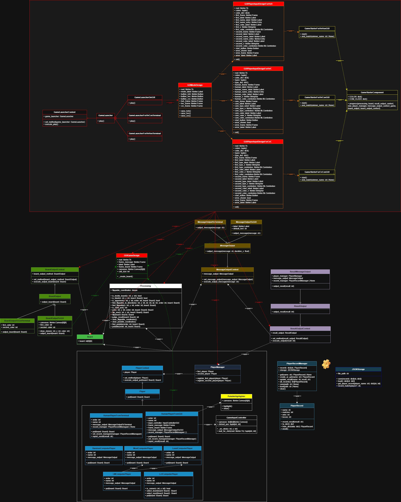

# プロジェクト名
OthelloGame

## 概要
オセロゲームを作っています。
今は最低限の機能しかありませんが、徐々にパワーアップしていく予定です。

## 目次
- [概要](#概要)
- [機能](#機能)
- [技術スタック](#技術スタック)
- [インストール方法](#インストール方法)
- [使い方](#使い方)
- [クラス図](#クラス図)

## 機能
- マウスを渡し合って2人で対戦
- コンピュータと対戦
- コンピュータ同士の対戦を観戦
- 石の色を変える
- 石を置くときの効果音を設定する
- 戦績の記録・閲覧(現在追加中)
- 自家製オセロAIとの対戦(追加予定)
- ブラウザ上で対戦(追加予定)

## 技術スタック
- 言語・フレームワーク: Python
- その他ツール: GitHub

## インストール方法
自分があまりわかっていないので、AIに書いてもらいました。

1. リポジトリをクローン
```bash
git clone https://github.com/LiGreTregret/OthelloGame.git
cd OthelloGame
```

2. Python（3.10 以上推奨）がインストールされていることを確認
```bash
python --version
```

3. 仮想環境の作成（任意）
```bash
python -m venv .venv
source .venv/bin/activate  # macOS/Linux
.venv\Scripts\activate     # Windows
```

## 使い方
1. ゲームを起動
```bash
python -m src.script.game_launcher
```

2. 画面の指示に従ってプレイ
- プレイヤー対コンピュータ
- プレイヤー対プレイヤー
- コンピュータ対コンピュータ

## クラス図
